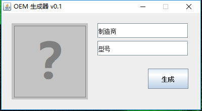
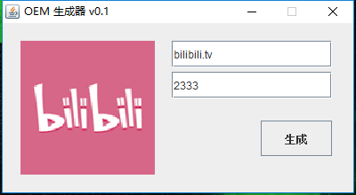
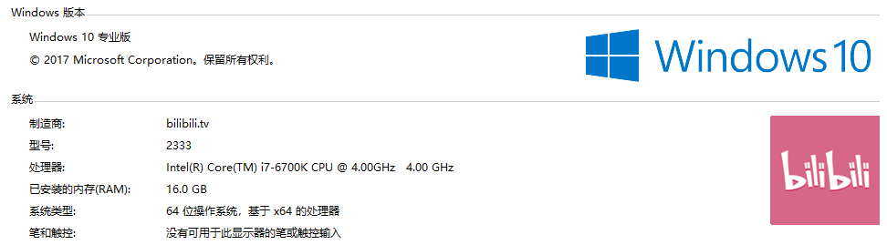

# Change-OEM

## 使用说明

　　下载编译运行代码，即弹出操作界面。
  

　　点击灰色问号弹出文件选择器，仅支持.bmp格式，尺寸大概120\*120~150\*150效果最佳，
不选择图片则不添加LOGO，制造商和型号信息清空对应也会清除注册表的对应信息。
  
例如：  

　　点击生成，中途会生成一个 C:\OEM 路径并写入一张图片（你选择的），一个.bat文件，一个.reg文件
成功之后.bat和.reg文件可删，图片文件删除会导致LOGO失效。中途会提示一些奇怪的东西，确定就好。

最终效果：

## 补充

　　实际原理就是根据选择和填写的信息生成一个.reg文件，然后用.bat去执行它。至于用.bat是为了申请管理员权限，不然的话就需要手动去运行.reg文件。
  生成一次之后就可以去改 C:\OEM\OEM信息.reg 然后运行一样的效果。（如果有大佬知道怎么能用java直接运行.reg、直接修改注册表、通过代码获得cmd管理员权限，
  求指点  感激不尽 ）
